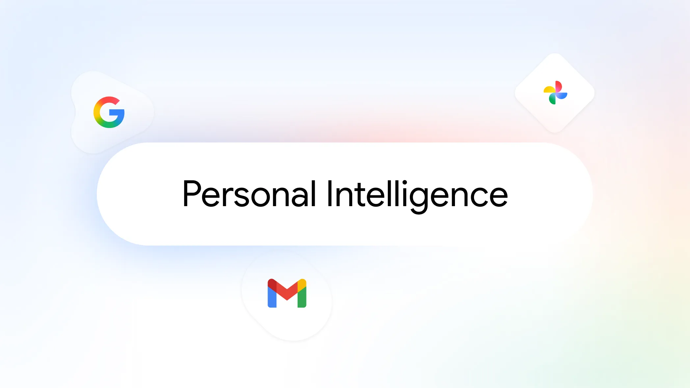

+++
title = "Google把“个人智能”推向搜索入口：AI Mode扩张背后的新工作流"
date = "2026-03-18T09:00:00+08:00"
slug = "google-personal-intelligence-ai-mode-expansion"
author = ""
authorTwitter = ""
cover = ""
coverCaption = ""
tags = ["AI 热点", "Google", "Gemini", "AI Mode", "搜索"]
categories = ["AI"]
keywords = ["Personal Intelligence", "AI Mode", "Gemini", "搜索体验", "个性化"]
description = "Google 官方宣布 Personal Intelligence 在 AI Mode 与 Gemini 中扩张，这不仅是一个功能更新，更是搜索工作流重构的信号。本文从真实场景切入，拆解它为何成为 AI 热点，并给出可落地的产品与工程步骤。"
showFullContent = false
readingTime = false
hideComments = false
color = ""
+++

凌晨 2:12，我盯着浏览器里那条“你之前保存的会议纪要”发呆。那是我一个月前写的草稿，本以为早就埋没在硬盘里。没想到，搜索框里一句“上次客户提到的预算上限是多少？”竟直接把它拎出来——带着上下文、带着建议、还顺便生成了会议要点摘要。那一刻我意识到：**搜索已经不再是“找信息”，而是在“延续记忆”**。

这就是今天的 AI 热点之一：Google 官方宣布 **Personal Intelligence（个人智能）在 AI Mode 与 Gemini 中扩张**，并将其推向更广泛的美国用户。它不是一个普通功能更新，而是 **搜索工作流重构的开关** —— 从“输入关键词→找网页”转为“输入意图→得到可执行建议”。

下面按清晰路径展开：先看它带来的效果，再解释为什么它会成为热点，最后给出可落地的产品与工程步骤。

## 效果展示：当“个人智能”进入搜索入口，体验发生了什么变化？

过去，搜索是一个“向外扩展”的过程：你输入问题，系统给你一堆链接；你自己筛选、自己拼接。现在，Personal Intelligence 让搜索变成“向内调用”：**把你的上下文、偏好、历史材料带进来**。

这带来三个直接变化：

1) **检索变成“回忆增强”**
- 你不再只是搜索全网，而是“搜索自己的知识与行为轨迹”。
- 过去要翻邮箱、翻文档、翻聊天记录的事情，现在变成一次提问。

2) **答案变成“可执行建议”**
- AI Mode 不只是给结论，还能输出下一步行动：草拟邮件、汇总要点、写会议摘要、列出待办。
- 搜索不再是信息终点，而是“行动起点”。

3) **搜索入口成为“个人工作流中枢”**
- 搜索框开始承担“记忆 + 规划 + 执行”多重角色。
- 这意味着：用户粘性不再来自内容量，而来自“继续帮你做事”的能力。

这也是它能成为热点的原因：**一旦搜索具备“个人智能”，工作流就会被重写**。

## 问题描述：为什么这件事会在此刻爆火？

热点不是偶然，而是多条趋势叠加的结果。

### 1) 大模型“答案泛化”的痛点被放大
用户已经习惯 AI 给出答案，但也越来越烦“泛泛而谈”。他们真正需要的是：
- 对我的项目有记忆
- 对我的语气有理解
- 对我的目标有偏好

Personal Intelligence 的出现，正是在解决“泛化答案”的问题：**让 AI 变得像“知道你的人”**。

### 2) 搜索流量红利正在枯竭
传统搜索靠的是“网页→点击→广告”。但在 AI 时代，用户越来越希望“直接得到解决”。搜索入口必须给出更强的“任务完成能力”，否则会被聊天式入口抢走时间。

### 3) 办公场景的 AI 需求从“写东西”转向“串流程”
过去 AI 主要用于写作、翻译、润色。现在，更多需求来自“跨工具串联”：
- 从资料到总结
- 从总结到行动
- 从行动到反馈

Personal Intelligence 的扩张，正是响应这个变化：**让搜索与工作流连起来**。

### 4) 竞争压力让“入口能力”成为关键
微软在 Copilot 上加速整合生态，Google 必须在搜索入口上形成“独特价值”。Personal Intelligence 是一种战略性的卡位——如果搜索入口能记住你并帮你行动，用户就更难流失。

## 步骤教学：如何把“个人智能”落地为真实可用的产品能力？

下面给出一条可执行路径，适合做产品设计、工程落地，或团队内推进。

### 步骤 1：从“记忆数据源”开始设计
Personal Intelligence 的本质是“可用的个人上下文”。你需要明确：
- 哪些数据源可以接入（文档、邮件、日历、聊天）
- 哪些数据允许被调用（隐私控制）
- 哪些信息必须“可解释”（来源可追溯）

**原则：宁可少接入，也要可控与可解释。**

### 步骤 2：建立“意图识别 → 记忆调用 → 生成”的三段式流程
一个可靠的个人智能系统，必须拆解成清晰链路：
1. 识别意图：你问的是查资料还是要行动？
2. 调用记忆：拉取相关上下文（文档、邮件、历史记录）
3. 生成输出：按场景生成摘要、建议或任务列表

拆开后，每一段都可以被优化与监控。

### 步骤 3：设计“默认回答策略”与“隐私边界”
个人智能最大的风险不是“答错”，而是“答得太多”。
- 默认只输出摘要，不直接泄露完整内容
- 对敏感信息加二次确认
- 给用户清晰的“记忆关闭”入口

**隐私控制是能力扩张的前提。**

### 步骤 4：把“回答”变成“行动”
AI Mode 的关键不是“答得好”，而是“帮你走到下一步”。
- 给出下一步模板（邮件草稿、会议纪要、行动清单）
- 支持一键确认后执行
- 保留“可回溯”的执行记录

这一步把搜索从“被动检索”升级为“主动执行”。

### 步骤 5：建立“长期价值”的反馈回路
Personal Intelligence 是长期能力，不是一次性功能。
- 记录用户编辑、拒绝与采纳的行为
- 通过小规模 A/B 测试优化输出
- 聚焦“节省了多少时间”这类可衡量指标

**让系统长期“越用越懂你”。**

## 升华总结：搜索的未来，是“个人智能的入口”

当我们讨论 AI 热点时，很多人关注的是模型参数、榜单排名、性能对比。但这次 Google 的动作提醒我们：**真正决定体验的，是入口里的“个人智能”**。

搜索不再是“找到信息”，而是“帮你完成任务”。当 AI Mode 能理解你的上下文、记住你的习惯、并推动你进入下一步行动时，它就从“工具”变成了“工作流伙伴”。

一句话总结：

> **AI 的下一个红利，不在于更聪明的答案，而在于更懂你的入口。**

只要这个入口建立起来，整个数字生活的操作逻辑都会被重写。今天的 Personal Intelligence 扩张，正是这个转折点的标志。

---

参考链接：
- Google 官方博客｜Personal Intelligence in AI Mode and Gemini expands in the U.S.：https://blog.google/products-and-platforms/products/search/personal-intelligence-expansion/
- CNBC｜Microsoft shakes up Copilot AI leadership team, freeing up Suleyman to build new models：https://www.cnbc.com/2026/03/17/microsoft-copilot-ai-suleyman.html
- POOROPS：https://www.poorops.com/

图源：
- Google 官方博客首图：https://blog.google/products-and-platforms/products/search/personal-intelligence-expansion/
