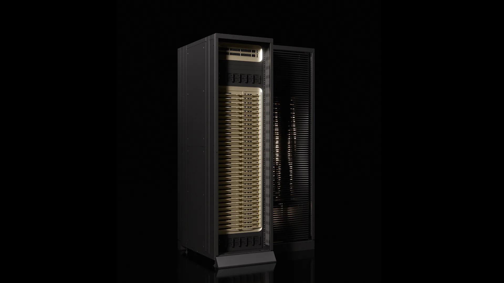

+++
title = "英伟达Vera Rubin平台与LPX：AI推理35倍跃迁的底层逻辑"
date = "2026-03-21T18:00:00+08:00"
slug = "nvidia-vera-rubin-lpx-inference-platform"
author = ""
authorTwitter = ""
cover = ""
coverCaption = ""
tags = ["NVIDIA", "Vera Rubin", "LPX", "AI推理", "算力平台"]
categories = ["AI"]
keywords = ["Vera Rubin", "LPX", "NVIDIA Rubin", "AI推理", "AI工厂", "推理吞吐"]
description = "从新闻发布到技术细节，拆解英伟达Vera Rubin平台与LPX如何把推理吞吐提升到35倍，并给出落地评估与部署路径。"
showFullContent = false
readingTime = false
hideComments = false
color = ""
+++

那天凌晨 2 点，我还在数据中心机房里盯着仪表盘。模型变大了，用户变多了，延迟像潮水一样一点点漫上来。每一次“再加一块卡”都只是在拖延，而不是解决。当我刷到 **NVIDIA Vera Rubin 平台与 Groq 3 LPX** 的发布信息时，第一反应不是兴奋，而是松了一口气：**“终于有人把‘推理吞吐’当成系统问题在解决，而不是只堆芯片。”**

这篇文章，我们就围绕这套平台，讲清楚一个问题：**为什么它会成为 2026 的 AI 热点之一？** 以及——如果你要在真实业务里吃到这波红利，应该怎么做。

为了把话说透，我会分四层：先看它“立竿见影”的效果，再说行业卡住的痛点，然后给出一套可落地的评估与部署步骤，最后回到更大的趋势判断。

## 效果展示：35× 推理吞吐，不是“更快”，而是“能做更多事”

Vera Rubin 平台和 LPX 带来的核心指标，是 **“每兆瓦推理吞吐提升 35 倍、万亿参数模型的收入机会提升 10 倍”**。听起来像营销口号，但如果你把它换成业务场景，会更直观：

- **你可以把同样的算力预算，用在 35 倍的请求量上**，而不是一味做“降级”或“排队”。
- **长上下文的 agent 任务可以从“试验”变成“常态”**，比如多工具链路的自动化分析、长文档审核、复杂 RAG。
- **模型分发方式被重新定义**：不只是训练→部署，而是把“推理”作为持续的生产力工厂。

如果说过去两年是“训练为王”，那么这次更新的意义是：**推理才是 AI 真正的经济引擎**。Vera Rubin + LPX，把“推理效率”从芯片层面提升为“平台能力”。

换成更具象的场景：

- 一个 7×24 小时的智能客服中心，峰值并发 10 万。过去你需要把请求分片、排队、限制长上下文；现在你有机会在相同电力预算下，**直接扩大并发窗口**。
- 一条“企业知识问答 + 工具调用”的 Agent 流水线，过去每个任务平均调用 5~8 次推理，成本高到只能用于“高价值客户”。现在有可能把它变成默认配置。
- 对于长文档审核与合规分析，之前不得不“分段+拼接”，现在可以更自然地使用长上下文，提高准确率与可追溯性。

这就是 35× 的真正意义：不是数字大，而是**业务范围被放大**。

为了理解它为什么能带来这种量级的差异，我们要先弄清楚：这次更新不再是“某一颗 GPU”的胜利，而是**平台级、机架级系统**的推进。NVIDIA 的官方表述反复强调“platform”“rack-scale”“AI factory”等关键词，也明确把 LPX 作为**低延迟推理加速器**与 Rubin 平台协同。换句话说，Vera Rubin + LPX 代表的不是“单点性能提升”，而是**把推理链路的各个环节一起打包升级**：硬件形态、互联方式、机架级配置，以及围绕推理任务设计的系统级能力。这也是它能成为 AI 热点的根因之一：行业开始把“推理”当成系统工程，而不是工程师的参数优化。

更关键的是，这类平台级架构让“机架”本身成为可编排的计算单元：当你部署的是一套协同工作的推理工厂，工程师就能围绕吞吐、能耗与调度策略做系统优化，而不是单机调参。这种变化决定了 AI 的成本结构与交付方式，因此，它不只是一次技术发布，更是一种**基础设施范式的切换**。

如果把时间线拉长来看，你会发现这正是 AI 基础设施的“第三阶段”：

- **阶段一：单卡/单机**，大家比的是峰值性能与模型规模。
- **阶段二：集群/分布式训练**，比的是训练效率与并行框架。
- **阶段三：机架级推理平台**，比的是吞吐、能耗与持续交付能力。

Vera Rubin 平台的出现，让第三阶段真正落地，这也是它为什么会被视为 AI 热点的原因之一。

## 问题描述：为什么“只升级 GPU”不够了？

在很多企业里，AI 性能瓶颈并不是模型本身，而是**整个推理链路**。当你把推理看成一条“生产线”，问题会更清晰：

1) **吞吐并不等于体验**
模型越大，系统越复杂。就算单卡性能提升，**多节点调度、缓存命中、上下文管理**这些问题仍然卡住整体性能。

2) **能耗成为实际约束**
推理是长期、稳定、高频的过程。**电力预算、机房冷却、峰值功率**逐渐成为第一位的限制因素。

3) **多模态与 Agent 负载让系统“非线性”复杂**
多模态输入、工具调用、长上下文，让每一次推理都更像“运行一条流程”，不是一次简单预测。这意味着：你需要的不是“更强 GPU”，而是**更强的推理系统**。

4) **成本曲线被需求吞噬**
每一次“更强模型”的升级，都会带来更高的调用频率、更长的上下文、更复杂的链路。只堆 GPU，最终会把成本曲线推上天。

Vera Rubin 平台的意义就在这里：**它在架构层面把推理这件事做成了系统工程，而不是单点提升。**

## 步骤教学：如何把“平台级提升”落到业务里？

下面给出一条可执行的路线，从评估到落地，避免盲目追热点。

### 步骤 1：先确认你的瓶颈在哪一层
很多团队上来就问“要不要上 Rubin”，但更关键的是：**你的瓶颈在哪里？**

- 如果你的瓶颈在 **模型吞吐** → 平台升级可能直接见效
- 如果你的瓶颈在 **数据/检索/缓存** → 先优化推理链路
- 如果你的瓶颈在 **业务流程** → 需要先重构 Agent 任务结构

你可以做一个简单的 7 天压力测试：把真实业务流量按“低峰/中峰/高峰”三档回放，记录每档下的 token 成本、尾延迟与失败率。**如果尾延迟飙升或成本线性上升，你就会知道问题在哪一层。**

**结论：先诊断，再决策。** 否则更强的算力可能只是加速“错误的流程”。

### 步骤 2：用“推理工作负载”而不是“模型参数”做评估
传统评估喜欢看参数规模，但在推理场景里，更重要的是：

- **每分钟请求量（RPM）**
- **平均上下文长度（token/req）**
- **工具调用次数（tool/req）**
- **tail latency（95/99 分位）**

你可以把每一次推理理解成“工作量”，而不是“参数量”。Vera Rubin 的优势在于**把高并发、长上下文、复杂任务的成本压到可运营区间**。你应该用“推理任务结构”来对齐平台能力。

### 步骤 3：把推理链路拆成“可观测的流水线”
如果要吃到平台级收益，你必须让推理链路可观察：

- **分层日志**：输入预处理 → 推理 → 后处理 → 工具调用
- **关键指标**：吞吐、延迟、能耗、缓存命中率
- **回滚机制**：当某个环节异常时可快速降级

**平台升级只是硬件基座，真正能放大价值的，是你的推理流程工程化。**

### 步骤 4：为 Agent 任务设计“推理预算”
在 Agent 时代，推理成本是可以“爆炸式上升”的：一次任务可能触发几十次推理。要想可持续，就需要预算思维：

- 对每个 Agent 任务设定 **token 限额**
- 给关键链路设置 **优先级队列**
- 对非核心任务启用 **降级策略**

这一步尤其重要，因为 Vera Rubin 平台带来的“35×提升”如果不加控制，最终也会被需求吞噬。

### 步骤 5：把“推理收益”换算成“业务指标”
平台升级最容易陷入“技术自嗨”。你需要把收益落到业务指标：

- 单次对话成本下降了多少？
- 95 分位延迟下降后，转化率提升了多少？
- 同样电力预算下，可承载的活跃用户提升了多少？

只有把推理指标与业务指标绑定，升级才有真正的 ROI。

### 步骤 6：准备一套“分阶段迁移”策略
即便平台再先进，也不可能一夜之间替换所有系统。建议按三阶段推进：

1) **试点阶段**：挑选 1~2 条高价值推理链路，验证吞吐、延迟与成本曲线。
2) **扩展阶段**：把最稳定的链路复制到相邻业务线，形成规模效应。
3) **平台化阶段**：把推理能力抽象成统一服务，供不同团队调用。

这样做可以降低迁移风险，也能让平台升级的收益逐步显现。

## 一个更直观的例子：从“提示词工程”到“推理工厂”

假设你在做一个面向企业的客服 Agent 系统：

- **过去**：你会用更大模型+更多 GPU 撑住高峰
- **现在**：你需要的是平台级推理能力，保证多任务并行、长上下文、低延迟

Vera Rubin + LPX 的定位就是：**让推理从“模型调用”升级为“可持续的工厂化输出”。** 这不仅是一张卡，而是一套面向 AI 时代的基础设施逻辑。

再具体一点：当你有 10 万并发咨询、且每个咨询可能触发 5~8 次工具调用时，系统瓶颈就不再是“模型聪明程度”，而是**推理的吞吐、延迟与能耗是否可控**。这一点决定了你的业务能不能规模化扩张。

如果你想把这个场景落到“可执行的指标”，可以这样做：

- **峰值并发预算**：把峰值并发转化为“每分钟可处理请求数”，并在系统层设定上限。
- **链路级 SLA**：拆分为“检索→推理→工具→回写”四段，每段有自己的延迟与成功率。
- **成本阈值**：对单次任务设定成本上限，超过阈值自动降级或切换模型。

当你把这些指标拉出来，平台升级的价值就会从“漂亮数字”变成“可运营的收益”。

## 升华总结：AI 真正的战场，正在从“训练”转向“推理”

我们已经进入一个新阶段：

- **模型增长速度放缓**，但推理负载呈指数上升
- **业务价值来自持续服务**，而不是一次性模型发布
- **算力效率决定利润空间**，不是理论峰值

Vera Rubin 平台与 LPX 的出现，本质上是在回答一个问题：

> **如果 AI 要成为基础设施，它的推理系统应该是什么样？**

答案是：不是更强的 GPU，而是**更强的推理平台**。当推理像流水线一样可控、可测、可持续，AI 才能真正从“技术演示”变成“商业基础设施”。

换句话说，2026 的 AI 热点不只是“模型更大”，而是“推理更可控”。当推理成本被压到合理区间，AI 才能从“试点”进入“规模化交付”。

而“可控”的本质并不神秘：它就是把推理当作工程系统来设计，包括架构、调度、能耗与成本模型。只要你把这些做成标准化组件，AI 就不再是一次性项目，而是能持续演进的生产力平台。

如果你在 2026 年做 AI 相关业务，可以用这句话判断自己是否需要认真关注它：

> **你的业务增长，是否被推理吞吐和成本卡住了？**

如果答案是“是”，那这可能就是你今年最值得跟进的一次平台级更新。

---

参考链接：
- NVIDIA 官方新闻：Vera Rubin 平台发布（https://nvidianews.nvidia.com/news/nvidia-vera-rubin-platform）
- NVIDIA 技术博客：LPX 低延迟推理加速器（https://developer.nvidia.com/blog/inside-nvidia-groq-3-lpx-the-low-latency-inference-accelerator-for-the-nvidia-vera-rubin-platform/）
- 配图来源：NVIDIA Developer Blog（https://developer.nvidia.com/blog/inside-nvidia-groq-3-lpx-the-low-latency-inference-accelerator-for-the-nvidia-vera-rubin-platform/）
- https://www.poorops.com/
