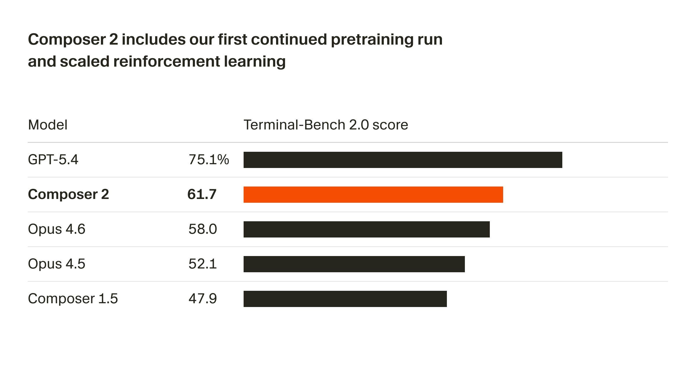

+++
title = "Composer 2让AI编程进入长周期时代：从基准跃升到工程落地"
date = "2026-03-24T18:00:00+08:00"
slug = "composer-2-long-horizon-coding"
author = ""
authorTwitter = ""
cover = ""
coverCaption = ""
tags = ["AI 热点", "编程模型", "Cursor", "代码智能体", "评测"]
categories = ["AI"]
keywords = ["Composer 2", "Cursor", "Terminal-Bench 2.0", "SWE-bench Multilingual", "长周期编程", "强化学习"]
description = "当编程模型进入长周期任务阶段，真正的分水岭不再是“会写代码”，而是“能完成一整段工程流程”。Composer 2的发布为这一转折给出了清晰信号。"
showFullContent = false
readingTime = false
hideComments = false
color = ""
+++

凌晨一点，办公室只剩键盘和风扇在作响。我盯着终端里堆到 200 多步的修复任务，心里只剩一个念头：**“这活如果能交给 AI 代理跑完就好了。”**

可现实是，过去一年的编程模型大多只能完成“短跑”——写一段函数、补一个小 patch、生成几行测试。**真正的工程任务，是马拉松。**它需要跨文件推理、反复调试、在多次失败后持续修正，直到一个完整功能落地。

就在这两天，“Cursor 推出 Composer 2”的消息冲上了 AI 热点榜。它不是又一个“更会写代码”的模型，而是明确对着“长周期编程”开火：在 Terminal-Bench 2.0、SWE-bench Multilingual 等基准上大幅跃升，并强调了持续预训练 + 强化学习带来的能力提升。

这篇文章按清晰结构展开：先看 Composer 2 带来的效果，再解释为什么编程模型一直难以完成长周期任务，然后给出一条可执行的工程落地路径，最后总结为什么这才是“AI 编程进入下一阶段”的关键拐点。

---

## 效果展示：从“写代码”到“做工程”的跃迁

**Composer 2 的核心信号是：它开始能跑完一整段编程流程，而不是只写出一段代码。**

官方信息提到三个关键点：

1) **基准跃升**：在 Terminal-Bench 2.0 与 SWE-bench Multilingual 等评测中取得明显提升，意味着模型更擅长终端环境下的真实编程场景，而不是单一题目式的“写函数”。

2) **长周期能力**：强调通过强化学习训练“长周期编程任务”，可完成需要数百步操作的复杂任务。这与真实工程极度贴合：编译、报错、定位、修复、重构、再测试，往往就是几十到几百步的循环。

3) **成本与速度明确**：定价按百万 token 计算，标准版输入 0.50、输出 2.50，另提供“同等智能但更快”的变体输入 1.50、输出 7.50，给工程团队留出成本与吞吐的权衡空间。

这意味着一个新阶段的到来：**编程模型不只是“写代码”，而是开始具备“完成任务”的系统性能力。**

下面这张图来自官方文章中的基准分数对比，可以直观看到 Composer 2 在 Terminal-Bench 2.0 上的表现（与其他模型相比更接近前沿）：

这并不只是“多了几个百分点”，它更像是一个能力分层：**短跑 → 中距离 → 长周期**。一旦跨过这条线，AI 编程从“辅助”走向“可交付任务”就有了现实基础。

---

## 问题描述：为什么“长周期编程”一直是 AI 的硬门槛？

过去两年，代码模型持续变强，但真正“跑不完”的问题一直存在。原因不是模型不聪明，而是工程任务天然复杂。主要难点集中在四个方面：

### 1) 目标是动态的，不是一次性命题
工程问题常常在执行中变化：需求调整、依赖版本冲突、隐式约束出现。**模型如果只会按初始目标写代码，就必然卡在“目标漂移”里。**

### 2) 过程有大量反馈回路
“写完就对”的情况很少。真实工程更像：

- 修改代码
- 运行测试
- 读报错
- 定位问题
- 再改

这种“反复迭代”才是编程的本质。过去模型缺乏稳定的“循环耐力”，每一次失败都会消耗上下文与注意力。

### 3) 终端环境不可控
与纯文本推理不同，终端里是实时状态机：

- 文件被改动
- 依赖被更新
- 日志不断刷新

**模型必须在动态环境中保持一致性，而不是只依赖静态上下文。**这就是 Terminal-Bench 这类评测被重视的原因。

### 4) 工程任务需要“规划能力”
长周期任务不是线性的，而是分阶段的：先搭环境、再实现功能、最后优化结构。如果没有清晰规划，模型就会陷入“写一堆能跑但无法维护的代码”。

简而言之：**长周期编程不只是“写代码”，而是“持续决策”。**这就是为什么它一直是编程模型的硬门槛。

---

## 步骤教学：把“长周期编程能力”变成可用工程流程

如果你是工程团队、技术负责人或个人开发者，想真正用好 Composer 2 这一类模型，可以按照以下步骤落地：

### 第一步：把任务拆成“能验证”的阶段目标
不要把完整功能一次性交给模型，而是拆成可验证的小阶段：

- 建立项目结构
- 完成核心功能函数
- 补齐测试
- 通过 CI

**每一步都必须有“成功判定”，否则长周期任务会变成无休止的游走。**

### 第二步：把“执行流程”写成固定节拍
为模型制定固定节拍：

1) 读取目标
2) 规划步骤
3) 执行修改
4) 运行测试
5) 总结结果

这种节拍可以显著降低“模型走偏”，尤其在多轮交互时非常关键。**长周期任务靠的是节奏，而不是灵感。**

### 第三步：让终端反馈成为“硬约束”
长周期编程的关键是**用真实反馈驱动下一步**。建议：

- 强制读取测试输出
- 禁止“凭想象”写修复
- 对失败日志做结构化归纳

这样模型不会在错误假设里打转，而是被终端事实拉回正确路径。

### 第四步：引入“多模型协作”策略
Composer 2 可作为主力执行模型，但在高难任务时可引入辅助模型：

- 主模型负责执行
- 次模型负责审查与复核
- 小模型负责快速检索与提要

**长周期任务要像团队协作一样分工，而不是让一个模型承担全部认知负担。**

### 第五步：建立“成本—收益边界”
长周期任务的成本不可忽视。Composer 2 提供了标准版与快速版两种价格区间，建议在不同阶段切换：

- 结构设计/规划 → 标准版（更稳定）
- 快速迭代/小修补 → 快速版（更高吞吐）

**把 token 成本与工程收益绑定，才能让“AI 编程”真正可持续。**

### 第六步：持续积累“失败样本”
每一次失败都是可复用资产。建议团队建立失败样本库：

- 哪些错误最常见？
- 哪些改动最容易引发连锁问题？
- 哪些测试用例最容易被忽略？

这些数据会让模型在长期使用中越来越可靠，**把“失败”转化为工程资产。**

---

## 升华总结：AI 编程进入“长周期时代”的真正意义

Composer 2 的发布，不只是一个新模型，而是一个信号：**AI 编程正在从“代码生成工具”迈向“工程执行者”。**

当模型能够在长周期任务中保持稳定、按步骤执行、面对失败仍能收敛，AI 才真正具备“交付能力”。这意味着未来的工程流程将发生结构性改变：

- 开发者从“写代码”转向“设计流程与验证结果”
- 代码生成从“辅助”变为“半自动交付”
- 项目节奏从“人的速度”转向“机器与人的协同速度”

**真正的分水岭不是模型参数更大，而是它能否在真实工程任务里持续完成闭环。**

Composer 2 只是一个起点，但它清晰地揭示了下一阶段的方向：**长周期编程，才是 AI 编程的主赛道。**

---

## 参考链接

- 来源：AI工具集（每日AI资讯、热点、动态）https://ai-bot.cn/daily-ai-news/
- 来源：Cursor 官方博客《推出 Composer 2》https://cursor.com/cn/blog/composer-2
- 来源：PoorOps https://www.poorops.com/

**图片来源**：Cursor 官方博客《推出 Composer 2》https://cursor.com/cn/blog/composer-2
