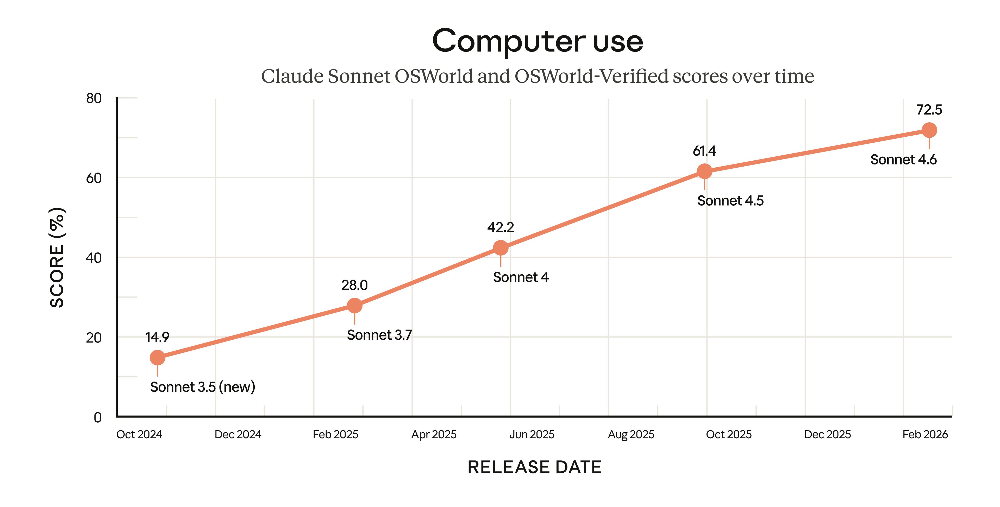

+++
title = "Claude Sonnet 4.6：AI 电脑操作迈过实用门槛"
date = "2026-03-25T09:00:00+08:00"
slug = "claude-sonnet-4-6-computer-use"
author = ""
authorTwitter = ""
cover = ""
coverCaption = ""
tags = ["AI 热点", "Anthropic", "Claude", "电脑操作", "智能体"]
categories = ["AI"]
keywords = ["Claude Sonnet 4.6", "computer use", "OSWorld", "智能体", "自动化"]
description = "Claude Sonnet 4.6 将电脑操作能力推过实用门槛：从“会聊天”走向“会做事”，AI 正在进入真实工作流。"
showFullContent = false
readingTime = false
hideComments = false
color = ""
+++

凌晨 2 点，我盯着桌面上一排密密麻麻的应用窗口：日历、表格、招聘后台、文档系统。真正让人疲惫的不是“思考”，而是重复操作：复制、粘贴、切换、确认、保存。你可能也经历过这种夜晚——不是没能力，而是被流程耗到精疲力尽。

就在这个时刻，AI 热点里蹦出了一个词：**“computer use（电脑操作）”**。Anthropic 发布的 Claude Sonnet 4.6，把电脑操作能力推到一个新的实用层级：它不只是更聪明的聊天模型，而是能像人一样在屏幕上完成点击、输入与跨应用流程的执行者。

这不是噱头，而是 AI 进入真实工作流的关键节点。本文将按清晰结构展开：**效果展示 → 问题描述 → 步骤教学 → 升华总结**，带你看清这件事真正的价值。

---

## 效果展示：从“文本助手”到“桌面执行者”

Anthropic 在官方公告中强调，Claude Sonnet 4.6 在多个维度取得提升，尤其突出“computer use”。这意味着：

1. **电脑操作能力显著提升**：官方明确表示，相比以往 Sonnet 模型，4.6 在电脑操作上有明显改进。
2. **任务能力跨过实用门槛**：过去需要 Opus 级别模型才能胜任的“真实办公室任务”，现在在 Sonnet 4.6 上也能完成。
3. **长上下文带来稳定性**：1M token 上下文窗口（beta）让模型在更长流程中保持一致性，降低“走偏”概率。

官方还特别指出，AI 过去需要为旧系统定制连接器，但**能像人一样操作电脑的模型**，可以直接在屏幕上完成流程，绕过接口成本。这对大量“没有 API 的软件”是巨大突破。

下面这张图来自 Anthropic 官方发布页（Sonnet 4.6 公告页），展示了这次发布的官方视觉信息：

更关键的是，Anthropic 提到 OSWorld（电脑操作领域的标准基准）显示了模型的持续进步。换句话说，这不是孤立的营销，而是模型在“真实操作任务”上的能力积累。

如果把它放进真实团队里，你会看到一个非常具体的变化：

- 过去：模型能写“更新招聘表”的说明，但人还得打开系统、复制粘贴、逐格确认。
- 现在：模型可以直接打开系统、定位字段、填入内容、保存，并在最后把变更结果回报给你。

这种变化并不只是“节省时间”。它让 AI 能够跨越“建议 → 执行”的鸿沟，成为流程链条里真正的一环。**这意味着 AI 开始具备“执行层”的能力**：不仅能告诉你怎么做，还能动手完成它。

如果把它放在几个常见场景里，你会更直观地感受到差异：

- **人力运营**：AI 直接在招聘系统里批量更新岗位信息，而不是只生成一份“更新建议”。
- **财务内控**：它能打开报销系统，核对字段并提交草稿，等待人工最终确认。
- **市场协作**：它能把活动数据从多个后台拉到统一表格，并自动生成日报草稿。

更值得注意的是，这类能力正在把传统 RPA（规则驱动的自动化）和大模型结合起来：

- RPA 擅长固定流程，但对变化无能为力。
- 大模型擅长理解语义，但过去缺少执行手。

电脑操作能力把两者连在一起，让“理解 + 执行”成为一个闭环。这是推动 agentic AI 真正走进办公室的关键一步。

此外，这一代 Sonnet 4.6 的意义还在于“可扩展性”：它不是为某一个业务定制的工具，而是一个**可以跨系统迁移的通用执行能力**。当模型的电脑操作变得可靠，企业不必为每个系统都写一套 API 或 RPA 流程，这会显著降低自动化成本。

---

## 问题描述：为什么“电脑操作”比聊天更重要？

很多人会问：模型已经很聪明了，为什么还需要“电脑操作”？原因很现实：**真实工作流不在聊天框里，而在 UI 的海洋中。**

### 1）工作流被界面分割
企业系统、内部后台、旧版工具，几乎都以 UI 为入口。没有电脑操作能力，AI 只能停留在“建议层”，无法真正完成任务。

### 2）API 不可能覆盖所有系统
要让 AI 参与一个旧系统流程，过去必须写接口，这成本极高。能“像人一样操作电脑”的模型，让 AI 绕过接口限制，直接进入现场。

### 3）流程是连续链条而非一次输出
真实操作往往是多步骤：打开页面 → 登录 → 选择菜单 → 填表 → 保存。中间任何一步偏航，就会导致任务失败。电脑操作能力意味着 AI 可以保持连续执行。

### 4）反馈闭环决定可靠性
真正完成任务的标准，不是“写出答案”，而是“执行成功”。电脑操作让 AI 能看到屏幕反馈，从而形成闭环。

因此，电脑操作不是一个锦上添花的功能，而是 AI 走向“可交付生产力”的核心门槛。

在真正落地前，还需要注意一个现实：**电脑操作能力越强，治理要求就越高。**许多团队会忽略“组织层面”的准备，结果不是 AI 不好用，而是流程没有接住它。你需要提前准备三类“底座能力”。

### 小结：落地前的三项准备

1. **权限治理**：为 AI 准备专用账号，权限要“够用但不过度”，避免它误触高风险动作。
2. **可观测性**：要求 AI 输出操作日志（截图、步骤列表、结果确认），让每一次动作都可追溯。
3. **可回滚机制**：流程中预留“撤销路径”，比如表格版本回退、发布前灰度、关键字段变更记录。

这三项准备看起来不直接“提升效率”，但它们决定了电脑操作能力能否长期稳定运行。没有治理，就没有生产力。

---

## 步骤教学：把“电脑操作能力”转化为可用流程

如果你想在团队中真正使用这类能力，可以参考以下路径。它强调“可控、可复核、可持续”。

### 第一步：从低风险高重复任务起步
适合起点的任务包括：

- 批量更新表格字段
- 归档会议纪要、整理会议记录
- 将公开信息录入系统
- 在后台批量更新文案或图片

这些任务的共同特征是：**重复、可复核、风险低**，适合模型先积累“稳定性经验”。

此外，可以在起步阶段强制让 AI “边做边解释”，例如每完成一步就口头或文本说明“我刚做了什么、下一步要做什么”。这不仅便于人类监督，也能减少模型迷失方向的概率。

### 第二步：给 AI 设定“执行节拍”
让 AI 按固定节奏执行，避免随机游走：

1) 明确目标与输出
2) 规划步骤（列出要操作的页面/按钮）
3) 执行操作（逐步推进）
4) 输出结果（截图/日志）
5) 等待确认

节拍不是限制，而是稳定性。**长流程的可靠执行靠的不是灵感，而是节奏。**

### 第三步：关键动作必须人工确认
涉及提交、删除、支付、外发的动作必须触发确认。AI 能操作桌面之后，风险成倍放大。**执行能力越强，安全阀越重要。**

### 第四步：建立“失败样本库”
任何失败都要记录：

- 卡在什么步骤
- 屏幕提示了什么
- 如何恢复

这些失败样本是优化流程的指南针，长期积累后会形成“自动化知识库”。

### 第五步：建立人机协同的责任边界
现实中最可持续的模式是：

- AI 执行“重复操作”
- 人负责“关键判断与最终确认”

这样能在效率和风险之间取得平衡，也让 AI 真正成为生产力伙伴，而不是“偶尔能用的 demo”。

### 第六步：建立“流程模板库”
电脑操作的价值，不只是“能做”，而是“可复用”。建议把验证过的流程沉淀成模板：

- 标准化入口（任务描述模板、操作边界）
- 固定化步骤（按钮路径、检查点、确认点）
- 结果格式化（输出清单、异常提示、截图存档）

这样做的好处是：团队可以在不同业务线快速复用，避免每次都从零开始。**模板库是让 AI 规模化落地的关键基础设施。**

### 第七步：把“结果”纳入指标体系
不要只看“完成与否”，而要跟踪：

- 平均完成时长
- 成功率与失败率
- 人工干预次数
- 单次流程成本
- 自动化覆盖率（哪些流程已被纳入可执行清单）

这些指标决定了 AI 是否真正进入生产流程，而不是停留在实验阶段。

如果你把这些流程搭建起来，就会发现一个意外的结果：**AI 不只是提高效率，它也在改变组织的协作结构。**

- 过去：很多团队靠“人的记忆”和“口口相传”来维持流程。
- 现在：流程被写成“可执行的脚本 + 可解释的步骤”，组织开始拥有“流程记忆”。

这意味着，即便某个关键员工离开，流程也不会完全断裂；即便业务增长，流程也更容易被复制扩展。**电脑操作能力让“隐性流程”变成了“显性资产”。**

当组织开始积累这些“流程资产”，它会逐渐形成一个新的竞争优势：**流程的可复制性本身成为护城河**。这也是为什么“电脑操作能力”不是单点技术，而是组织效率升级的基础设施。

---

## 升华总结：真正的分水岭是“执行权”

过去几年，AI 的突破大多发生在“语言层”，我们习惯了它能写、能总结、能回答。但这些能力终究是“建议层”。

**电脑操作意味着执行权的转移。**当 AI 可以在屏幕上完成步骤，它就开始成为流程的执行者，而不是仅仅是一个顾问。

Claude Sonnet 4.6 的意义，不在于它又多聪明了一点，而在于它把“电脑操作能力”推过实用门槛，让 AI 开始真正进入真实工作流。它让我们第一次清晰地看到：AI 可以把“理解语言”与“执行动作”连成一条链路。

未来的竞争点不再只是“模型更大”，而是：**谁能让 AI 更稳定、更可控、更可靠地完成任务**。能做到这一点的组织，将拥有更快的执行速度、更低的运营成本、更强的流程复制能力。

简而言之，Sonnet 4.6 带来的不是一项孤立功能，而是一种“新的工作方式”。当 AI 真正能操作电脑，工作流的重心将从“人执行、AI辅助”转向“人设计、AI执行”。这就是它之所以成为热点的核心原因。
---

## 参考链接

- 来源：Anthropic 官方博客《Introducing Claude Sonnet 4.6》https://www.anthropic.com/news/claude-sonnet-4-6
- 来源：Axios《Anthropic's Claude Sonnet 4.6 is faster, cheaper》https://www.axios.com/2026/02/17/anthropic-new-claude-sonnet-faster-cheaper
- 来源：PoorOps https://www.poorops.com/

**图片来源**：Anthropic 官方博客《Introducing Claude Sonnet 4.6》https://www.anthropic.com/news/claude-sonnet-4-6
