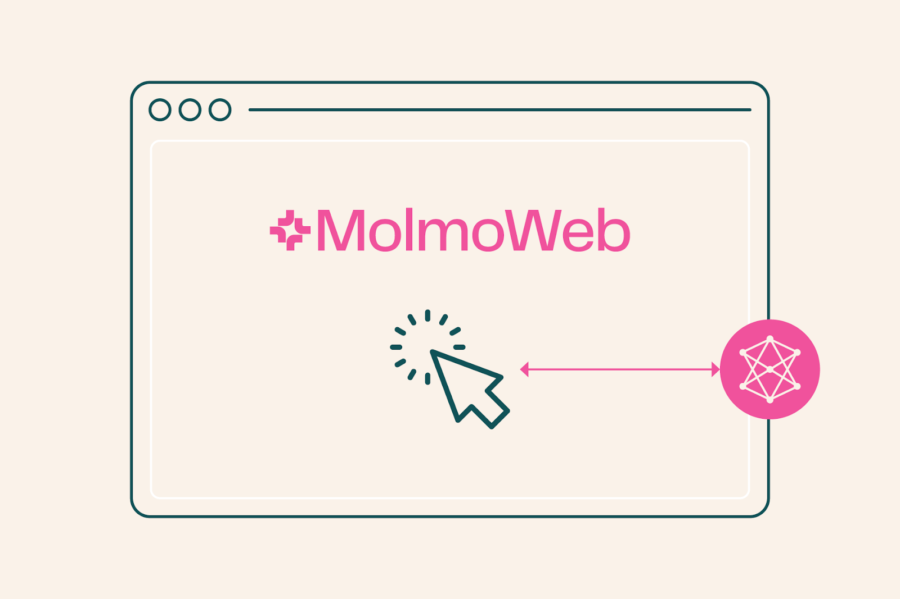

+++
title = "MolmoWeb：开源网页智能体把“可执行”带回社区"
date = "2026-03-26T09:00:00+08:00"
slug = "molmoweb-open-web-agent"
author = ""
authorTwitter = ""
cover = ""
coverCaption = ""
tags = ["AI 热点", "开源", "智能体", "网页自动化", "多模态"]
categories = ["AI"]
keywords = ["MolmoWeb", "Ai2", "网页智能体", "web agent", "Molmo 2", "开源"]
description = "MolmoWeb 把网页智能体从黑盒变成可复用的开源堆栈：权重、数据、代码与评测一起放出，让“可执行”的能力真正进入工程与研究流程。"
showFullContent = false
readingTime = false
hideComments = false
color = ""
+++

凌晨的项目群里跳出一条链接：**“Ai2 发布 MolmoWeb，开源网页智能体”**。我点开后，第一反应不是兴奋，而是松了一口气——过去一年里，网页智能体像一场“黑盒竞赛”，能力在提升，细节却被遮住。开发者只能看见演示视频，却摸不到训练数据、流程设计与评测细节。

而 MolmoWeb 的出现，让这一切有了“可复盘”的可能。
那一刻我脑子里浮现的，是上周团队做的一个小实验：让智能体去后台系统批量更新商品标题。它能跑，但每隔十几次就会“卡壳”——弹窗广告、页面慢加载、按钮轻微改名……任何一个细节都足够让流程中断。

当时我们只能一边录屏、一边手动修补。问题不在模型本身，而在缺乏“可复盘的工程栈”。MolmoWeb 的开源动作，像是给这种日常尴尬找到了出口：**把问题摊开，让全社区一起修。**
它不仅给出模型权重，还附带训练数据、评测工具与工程流程——**这是一次把“可执行”能力带回社区的动作**。本文按 **效果展示 → 问题描述 → 步骤教学 → 升华总结** 的结构，拆解 MolmoWeb 为什么能成为 2026 年 3 月最值得关注的 AI 热点之一。

---

## 效果展示：当网页智能体不再是“黑盒演示”

Ai2（Allen Institute for AI）在官方博客宣布：**MolmoWeb 是基于 Molmo 2 的开源视觉网页智能体**，提供 4B/8B 两个模型规模，并同步开放了权重、训练数据、评测与工具链。这意味着：

1. **模型权重开源**：开发者可以直接部署、微调或复现实验。
2. **训练数据开放**：包含大量人类网页操作轨迹，让“从人类操作到智能体执行”的学习过程可见。
3. **评测与工具链公开**：让不同团队能在同一基线上对比，避免“只会演示不会落地”的问题。

官方发布页中展示了 MolmoWeb 的核心视觉信息（截图来自 Ai2 官方博客）：

这不仅是一个新模型的发布，更像是一次“完整工程堆栈”的开放。换句话说，**MolmoWeb 给的是“可以复用的能力”，而不是“只能看不能改的神秘演示”**。
在这条发布里，有两个细节格外值得注意：

- **不是只开源模型，而是开放“全流程”**：权重、数据、评测、工具链同时出现，意味着社区可以把能力“拆开看”。
- **不是只追求单点效果，而是强调可复现**：当你能复刻训练过程，你就能判断“为什么它成功”，并把改进路径写进工程决策。

如果你做过网页自动化，就会理解这两点的意义——真正难的不是“能点到按钮”，而是“能稳定地反复点对按钮”。开源让稳定性变成可被讨论、可被修正的工程问题。

更具体地说，MolmoWeb 的能力表现为：

- 可以根据屏幕截图规划下一步操作（点击、输入、滚动）。
- 可以处理多步骤网页任务，比如表单填写、信息检索、页面导航。
- 能在通用网页环境中复用，不需要为每个网站写 API 适配层。

在当前“Agent 竞赛”里，**真正稀缺的不是演示效果，而是可落地的工程化能力**。
想象这样一个场景：

- 你让智能体“帮我在三家供应商网站上比价并生成表格”。
- 它进入网页、检索商品、抓取价格、填进表格，最后回传一份结构化结果。

过去，这类任务要么需要定制爬虫，要么依赖脚本+RPA。现在，网页智能体让“自然语言任务”直接变成“可执行动作”。这一点看似简单，却意味着工程入口发生了变化。
MolmoWeb 把这件事推到了一个新的可验证层级。

---

## 问题描述：为什么“开源网页智能体”突然变成热点？

过去一年，网页智能体成为大模型应用最火的方向之一，但也暴露出三个痛点：

### 1）能力强，但不可复制
很多闭源系统只能通过演示视频感知能力，但开发者无法验证其训练过程与稳定性。**结果是：大家看到了“能做”，却无法确定“能不能复用”。**

### 2）工程落地成本高
没有开源堆栈，就意味着每个团队都要从零开始搭建：采集数据、定义任务、训练模型、评测系统。成本极高，速度极慢。

### 3）评测缺乏统一基线
不同团队的评测方法各异，导致“效果好”难以对比。**没有公开基线，就没有真正的工程共识。**

MolmoWeb 的价值就在这里：它把“网页智能体”从演示级别拉回到“可工程化复用”的路径。
### 4）闭源代理与开源代理的“可控差异”
闭源系统给的是“能力”，开源系统给的是“可控”。真正落地时，团队更关心：

- 我能否知道模型为什么失败？
- 我能否针对特定网站做微调？
- 我能否在合规边界内运行它？

这些问题如果无法回答，智能体就很难从试验走向生产。
它告诉社区：**网页智能体不是神话，而是一条可以被验证、被扩展、被落地的工程链路。**
再往下看，你会发现网页智能体真正的复杂度来自三个“隐形成本”：

- **界面变化成本**：按钮位置、弹窗提示、字段名称随时会变，导致模型需要“视觉鲁棒性”。
- **网络环境成本**：加载延迟、登录状态失效，会把本来简单的流程变成多分支决策。
- **合规与风险成本**：一旦智能体具备“执行权”，谁来承担错误操作的责任？这要求治理与审核机制先行。

这些成本过去被隐藏在演示背后，而 MolmoWeb 的价值在于让它们“可见、可测、可改”。

---

## 步骤教学：如何把 MolmoWeb 用成可落地的网页智能体

如果你准备把 MolmoWeb 引入自己的产品或研究流程，建议遵循以下路径：

### 第一步：锁定场景，避免“万事皆可”
MolmoWeb 擅长的是多步骤网页任务，但并不是所有网页场景都适合。优先选择：

- **高重复、低风险**的后台操作（例如表单录入、信息查询）
- **步骤清晰、可回滚**的流程
- **有明确成功/失败标准**的任务

场景越清晰，智能体成功率越高。

### 第二步：建立任务拆解模板
在正式调用前，先把任务拆成固定结构：

1) 输入目标（用户想完成什么）
2) 列出网页路径（需要进入哪些页面）
3) 定义关键动作（点击、输入、确认）
4) 设定成功标志（页面出现什么才算完成）

MolmoWeb 的优势是“能做”，但想要它“稳定做”，就需要模板化路径。

### 第三步：引入人工确认闸门
任何涉及提交、付款、删除等高风险动作，必须插入人工确认。**可执行能力越强，治理越关键。**

最简单的做法是：

- 在关键步骤前输出截图
- 列出即将执行的动作
- 等待人工确认再执行

### 第四步：建立失败样本库
网页智能体的失败往往是“细节偏航”：按钮变更、页面加载延迟、弹窗遮挡。建议建立失败样本库：

- 记录失败页面截图
- 记录模型的动作序列
- 标注失败原因

这些失败样本会成为后续优化策略的燃料。

### 第五步：以“流程资产”思路复用
当任务跑通一次后，不要止步于“能用”。把流程沉淀成模板：

- 固定化输入字段
- 标准化步骤
- 统一化输出格式

这样每一次成功执行都会变成“流程资产”，而不是一次性演示。

### 第六步：加入“可解释日志”与指标体系
在真实场景中，老板关心的不只是“能不能做”，而是“可不可以追责、可不可以优化”。建议建立两类指标：

- **执行类指标**：成功率、平均耗时、人工干预次数。
- **风险类指标**：高风险动作次数、被拦截次数、异常回滚次数。

同时要求智能体输出“可解释日志”：每一步操作、页面截图、动作理由。这样才能让智能体真正进入生产流程。

### 第七步：从“单点任务”过渡到“任务链”
网页智能体的价值，不止是完成一个动作，而是把多个动作串成链：检索 → 填写 → 提交 → 归档。

如果你能把任务链沉淀为模板，就能让智能体成为“业务流程的执行模块”，而不是“单次演示工具”。

### 第八步：做好“权限与身份隔离”
智能体能操作网页之后，**账号体系就是安全底座**。建议：

- 为智能体创建专用账号（权限最小化）
- 所有关键动作记录日志并保留截图
- 对高频操作进行限流，避免“暴力点击”触发风控

### 第九步：把“人类意图”写成清晰约束
不少失败来自“需求描述过于模糊”。把任务描述写成约束条件：

- 允许访问哪些页面
- 只能修改哪些字段
- 遇到异常时如何暂停

这会显著减少智能体的“随意性”。

---

## 升华总结：开源让“可执行”变成集体资产

网页智能体的竞争焦点从来不是“谁的演示更炫”，而是**谁能让能力真正可复用、可验证、可工程化**。

MolmoWeb 的意义在于：它把“网页智能体”从黑盒状态拉回到开源社区，让开发者可以拆解、改进、复用。这让智能体不再是少数大公司的专利，而变成一种**可以被集体迭代的工程能力**。

当一项能力被开源，它的价值不只是“能用”，而是“能被更多人扩展”。这就是 MolmoWeb 成为热点的原因：它不是一个新模型的发布，而是一次**智能体工程范式的开放**。

再看大背景：过去两年，智能体生态一直卡在一个悖论——**模型越来越强，但落地越来越难**。原因不是能力不足，而是“缺乏可控的工程路径”。MolmoWeb 把路径摊开，意味着：

- 研究者可以围绕公开数据构建更透明的评测体系；
- 工程团队可以基于开源堆栈快速迭代；
- 产品团队可以把“执行能力”纳入更长期的业务规划。

这让网页智能体从“热闹的演示”变成“可持续的生产力工程”。

下一阶段，我们会看到更多团队在 MolmoWeb 之上做两件事：

1. **把网页智能体嵌入真实业务流程**，从内部系统开始自动化。
2. **把评测和治理标准化**，让“可靠执行”成为行业共识。

真正的分水岭不是“模型会不会操作网页”，而是“整个社区能不能共同把它变成可复制的生产力”。MolmoWeb 的出现，让这条路径变得清晰可见。
最后想强调的是：网页智能体不是一个“取代人”的按钮，而是一种“把执行权转化为可编排能力”的技术。它会让组织重新思考：哪些流程值得自动化？哪些动作必须留给人？在这个过程中，**治理与透明度会比纯粹的模型能力更重要**。

---

## 参考链接

- 来源：Ai2 官方博客《MolmoWeb: An open agent for automating web tasks》https://allenai.org/blog/molmoweb
- 来源：GeekWire《Ai2 releases open-source web agent to rival closed systems from OpenAI, Google, and Anthropic》https://www.geekwire.com/2026/ai2-releases-open-source-web-agent-to-rival-closed-systems-from-openai-google-and-anthropic/
- 来源：PoorOps https://www.poorops.com/

**图片来源**：Ai2 官方博客《MolmoWeb: An open agent for automating web tasks》https://allenai.org/blog/molmoweb
