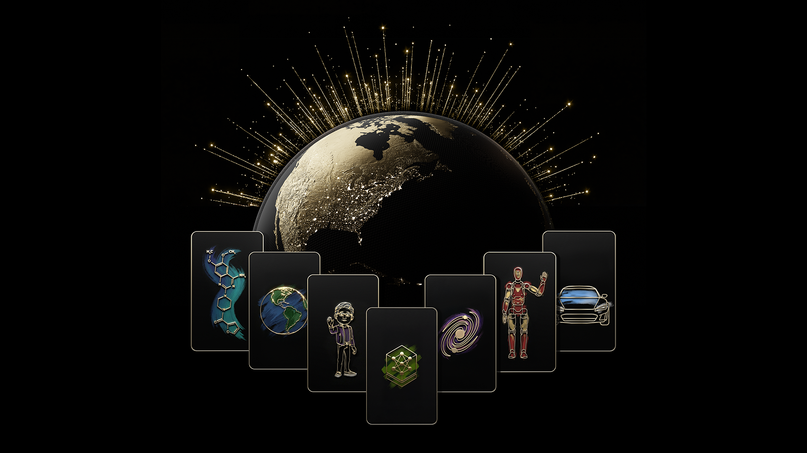

+++
title = "NVIDIA开源模型家族扩张：把Agentic与Physical AI推向可落地时代"
date = "2026-03-31T09:00:00+08:00"
slug = "nvidia-open-model-families-agentic-physical-ai"
author = ""
authorTwitter = ""
cover = ""
coverCaption = ""
tags = ["AI 热点", "NVIDIA", "开源模型", "Agentic AI", "Physical AI", "机器人"]
categories = ["AI"]
keywords = ["NVIDIA", "Nemotron 3", "Isaac GR00T N1.7", "Cosmos 3", "开源模型家族", "Agentic AI", "Physical AI"]
description = "NVIDIA 在 GTC 宣布扩展开源模型家族，涵盖 Agentic 与 Physical AI。本文以故事化开头拆解效果、问题、落地步骤与行业意义。"
showFullContent = false
readingTime = false
hideComments = false
color = ""
+++

清晨 7:30，机器人实验室的灯还没全亮。我盯着一段失败日志：机械臂刚学会抓取新零件，下一轮却像“忘了路”。而在隔壁的运营群里，朋友们正被一句话刷屏——“**NVIDIA 扩展开源模型家族，把 Agentic AI 和 Physical AI 送进工业现场**”。

我意识到，这不是又一次“模型更新”的新闻，而是一条从研究走向落地的线路：**一套面向“能动手、能落地”的开放模型体系**。从能对话的智能体，到能在现实世界中行动的机器人，NVIDIA 正在把“可用的 AI”变成“可交付的 AI”。

下面按“效果展示 → 问题描述 → 步骤教学 → 升华总结”的结构拆解这次热点。

---

## 效果展示：开源模型家族为什么突然成为“产业级爆点”？

这次扩张的关键词不是“参数更大”，而是“**覆盖更完整的能力链条**”。官方信息里提到的几个名字，指向三个方向：

1) **Agentic AI（能自主行动的智能体）**：NVIDIA Nemotron 3 系列“omni-understanding”模型，强调多模态理解与复杂推理，为企业级智能体提供底座。
2) **Physical AI（能在真实世界行动的智能体）**：比如 Isaac GR00T N1.7（面向人形机器人）与 Cosmos 3（面向物理环境模拟和推理）。
3) **Healthcare 与其他行业模型**：面向医疗、工业、制造场景的专用模型扩展。

它们带来的直接效果是：**从“对话模型”升级为“能执行任务的系统拼图”**。而且“开源”意味着这些能力可以被开发者拿来“接入流程”，而不是只能被动使用演示。

更直观地说：
- 你不再只是“让模型回答问题”，而是让模型**完成跨系统任务**。
- 你不再只看一次 Demo，而是能把它塞进**生产流程**。
- 你不再只关注“模型性能”，而是开始关注“**落地稳定性与安全边界**”。

> **这才是“热点”的本质：从炫技到可交付。**

---

## 问题描述：为什么真正的挑战不是“模型能力”，而是“落地链路”？

过去一年里，大家都在讨论 Agentic AI 和 Physical AI，但“能动手”从来不是终点。真正的难点在于**如何把它们放进真实业务里**。

### 1) 能力碎片化：模型很强，但拼不成系统
很多团队都有这样的问题：模型能推理、能对话、能看图，但**一旦要跨应用执行任务，链路就断了**。缺的不是能力，而是一个稳定的“**执行栈**”。

### 2) 现实世界不可控：Physical AI 不是模拟器
机器人面对的是灰尘、光线、摩擦、噪音和不完美的传感器。哪怕模型再强，如果**缺少场景适配和工程约束**，真实世界就会把它“打回实验室”。

### 3) 组织需要可治理的 AI
企业不怕模型犯错，怕的是**错误不可追踪、不可审计、不可控制**。在 Agentic 与 Physical AI 场景，安全和治理是第一优先级。

> 换句话说，热点背后真正的焦点是：**如何把模型“变成系统”，把实验“变成流程”。**

---

## 步骤教学：把开源模型家族落地为“可交付系统”的 5 步法

下面是一套面向企业与开发者的实操路径。不是“如何下载模型”，而是“**如何把它变成可交付能力**”。

### 步骤 1：先定义场景，再选择模型
不要从“模型清单”出发，而是从“流程需求”出发：

- 是跨系统的信息处理？（更偏 Agentic AI）
- 是复杂视觉理解？（需要多模态）
- 是物理执行？（需要 Physical AI 与仿真）

**选模型不是选最强，而是选最合适。**

### 步骤 2：搭建“执行边界”与安全围栏
Agentic AI 最大风险是“能动手”。必须明确：

- 可访问的系统范围
- 允许执行的动作列表
- 高风险动作必须人工审批

没有围栏，模型越强风险越大。

### 步骤 3：建立“模拟 → 小流量 → 生产”的验证阶梯
Physical AI 必须用仿真做第一轮验证，再进入有限场景测试，最后才进生产：

- **仿真训练**：降低现实成本
- **沙盒验证**：观察失败模式
- **局部试点**：逐步放量

> 这一步是“工程上限”，也是“安全底线”。

### 步骤 4：引入持续监控与可解释日志
开源模型只是起点，关键是**运行中的监控与可解释性**：

- 操作日志（每一步行动记录）
- 失败告警（异常检测）
- 结果校验（自动回归测试）

**可解释性不是锦上添花，而是生产必需品。**

### 步骤 5：把人类审查嵌进关键节点
无论 Agentic 还是 Physical，都需要“人类确认点”：

- 关键任务前人工确认
- 任务完成后人工复核
- 高风险任务必须有“人工刹车”

**人类不是阻碍，而是安全阀。**

---

## （配图）开源模型家族的官方视觉

---

## 升华总结：AI 热点的真正含义，是“可交付时代”

这次 NVIDIA 的动作，不只是“更多模型”。它真正指向的是：**让智能体与机器人从“研究热点”变成“产业基础设施”。**

当模型被打包成“家族”，你就不再只是选择一个模型，而是在选择一套**可扩展、可治理、可落地**的能力体系。这意味着：

- **AI 的竞争进入“系统工程”时代**
- **开源成为“可治理”的前提**
- **从 Demo 到生产的距离开始缩短**

如果你正在建设 AI 能力，请记住一句话：

> **模型只是起点，系统才是终点。**

这也是今天“AI 热点”最值得被记住的原因。

如果把这次扩张看作一张路线图，它告诉我们未来的关键不是“再造一个更强的模型”，而是“把模型、工具链、评测与治理打包成能复用的基础设施”。当这些拼图越来越完善，AI 才能真正进入“规模化交付”的阶段。

---

参考链接：
- NVIDIA Newsroom｜NVIDIA 扩展开源模型家族，推动 Agentic、Physical 与 Healthcare AI：https://nvidianews.nvidia.com/news/nvidia-expands-open-model-families-to-power-the-next-wave-of-agentic-physical-and-healthcare-ai
- NVIDIA Investor Relations｜NVIDIA 扩展开源模型家族官方新闻稿：https://investor.nvidia.com/news/press-release-details/2026/NVIDIA-Expands-Open-Model-Families-to-Power-the-Next-Wave-of-Agentic-Physical-and-Healthcare-AI/default.aspx
- 站点主页：https://www.poorops.com/
